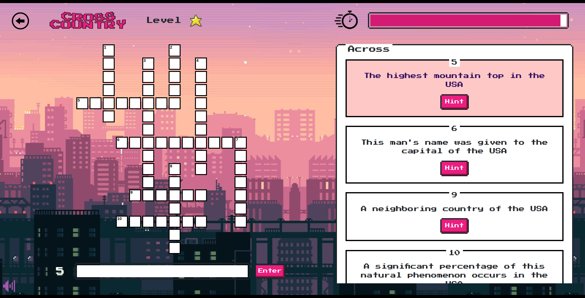

# Crosscountry

<p align="center">
  
</p>

Crossword Game Project Prototype

## Installation/Development

1. Clone the project <br>
   `git clone https://github.com/re-nanashi/crosscountry-usa.git`

2. Go the directory and run npm install

```
npm install
```

3. Build the game

```
npm run build
```

4. Run the game by opening ./dist/index.html

## TODO

- Refactor in the future for a more simpler and understandable structure.
- Add more sources.
- Add database.

## Note

**This service was created for personal use. It is not meant to be for commercial or business purposes.**

## Author

John Reymar I. Fabro(Me)
[@juanfab.af](https://www.instagram.com/juanfab.af/)
